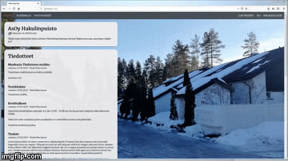

# Websites for Hakulinpuisto housing association

Purpose of this webiste is to practice styling with CSS and building 
small website for my housing association to inform the tenants.

Features:
- Basic account management (register/login/logout)
- Editing the account information
- Creating / Updating / Deleting posts
- Responsive layout with self-made CSS

# Stack
- Backend: Python with Flask
- Frontend: Custom handmade CSS

# Demos of the site
### Index page with announcements for tenants

### Creating the announcement

### Editing the announcements

### Expandable mobile navigation

### Creating and logging in on mobile

